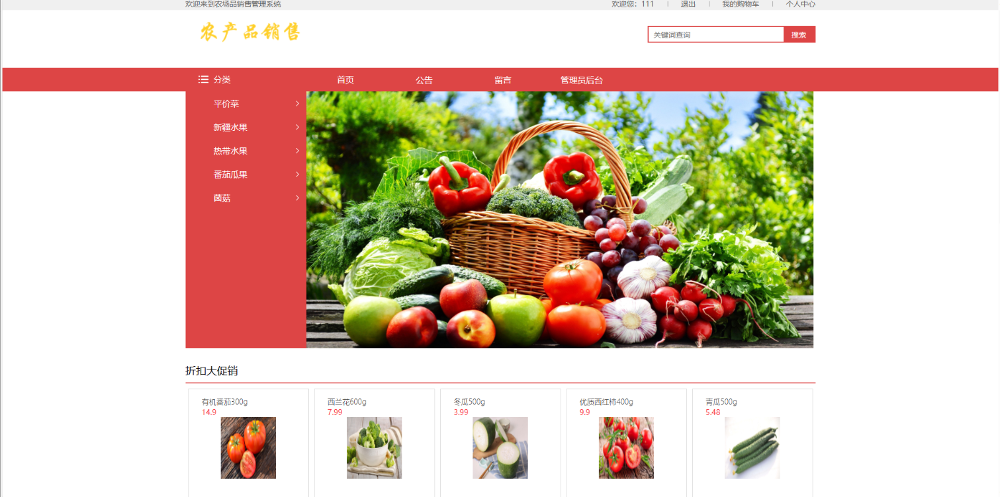
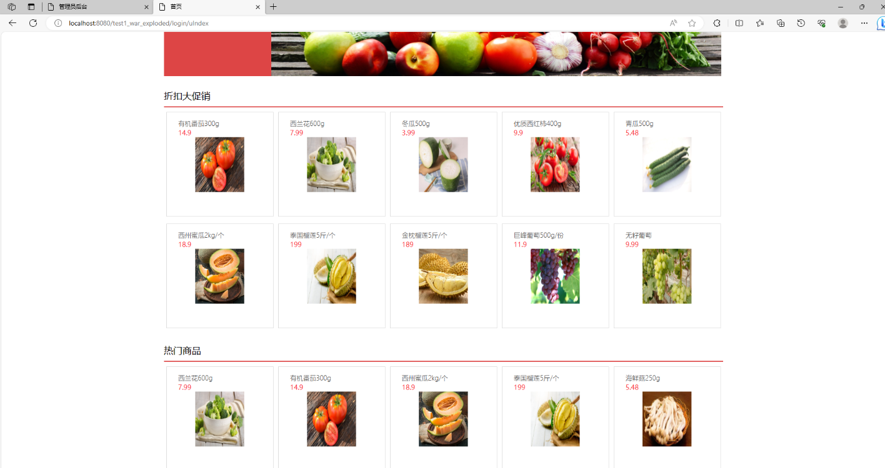
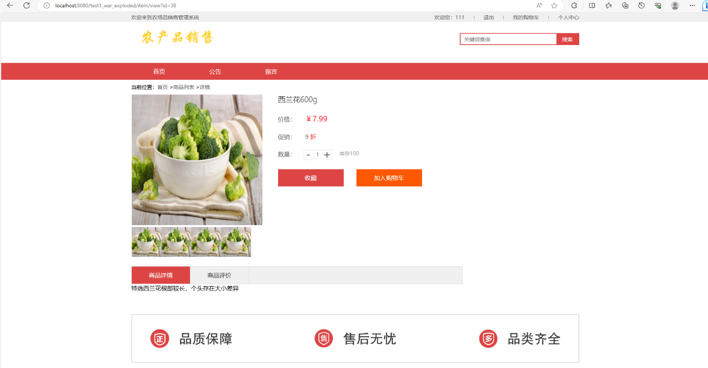
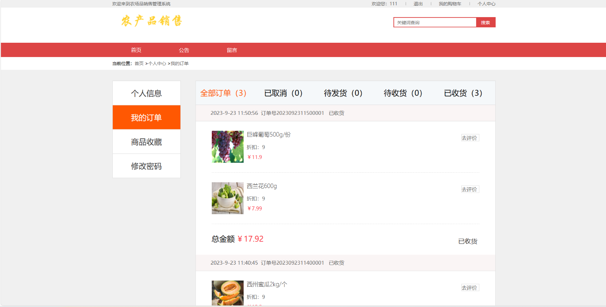
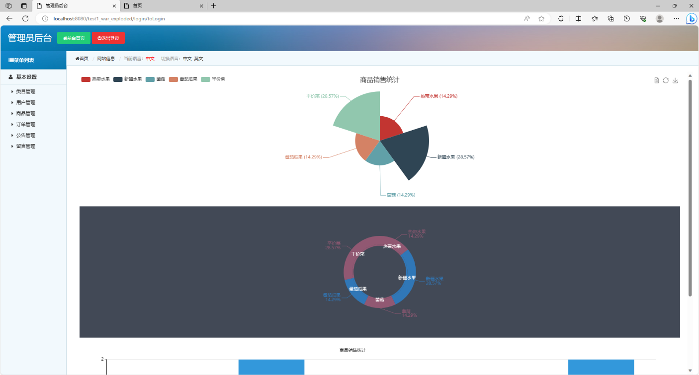
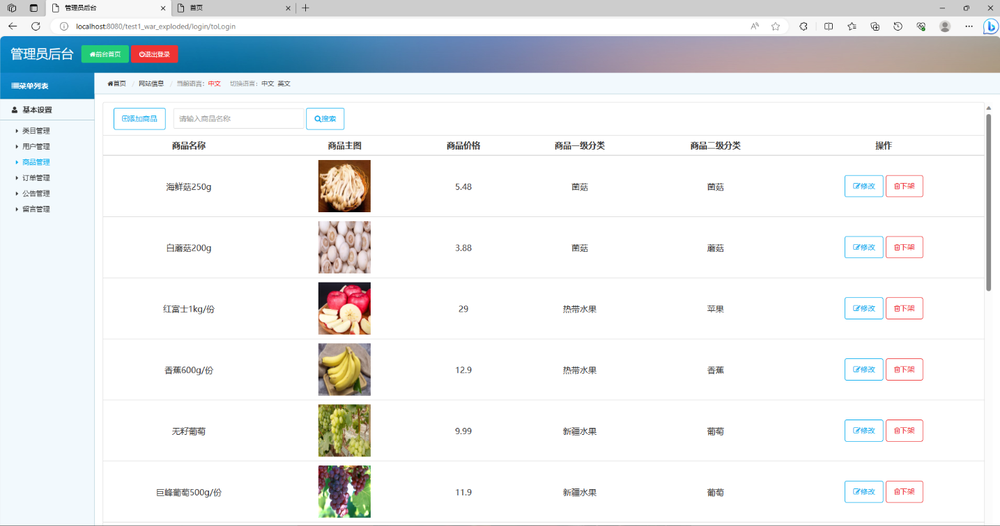

# 基于SSM的农产品销售管理系统

### 9.9￥ 获取完整源码+sql，需要加Q：3577148218 ,微信: qszard26
### 有问题，或者需要协助调试运行项目的也可联系
### 获取更多项目，关注搜索微信公众号id：xzzard
### 或者关注公众号名称：编程项目集

## 一、介绍

功能（用户端+管理端）:

用户前台功能：登陆，注册，商品分类，搜索，商城首页浏览，查看商品详情页面，收藏与加入购物车（需登录使用），订单，留言功能，个人中心

管理后台功能：类目管理功能（对前台商品分类，增加和删除类目），用户管理，商品管理，订单管理，公告管理，留言管理

语言：java

技术：ssm（spring+spring MVC+mybatis）+jsp+jQuery

数据库：mysql

开发环境：idea或eclipse

## 二、系统部分功能页面展示

### 9.9￥ 获取完整源码+sql，需要加Q：3577148218 ,微信: qszard26
### 有问题，或者需要协助调试运行项目的也可联系

