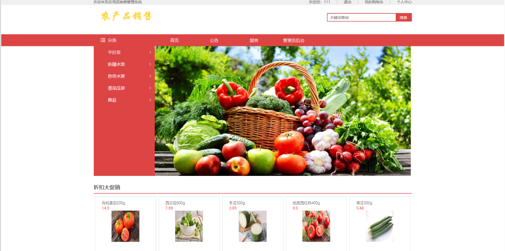
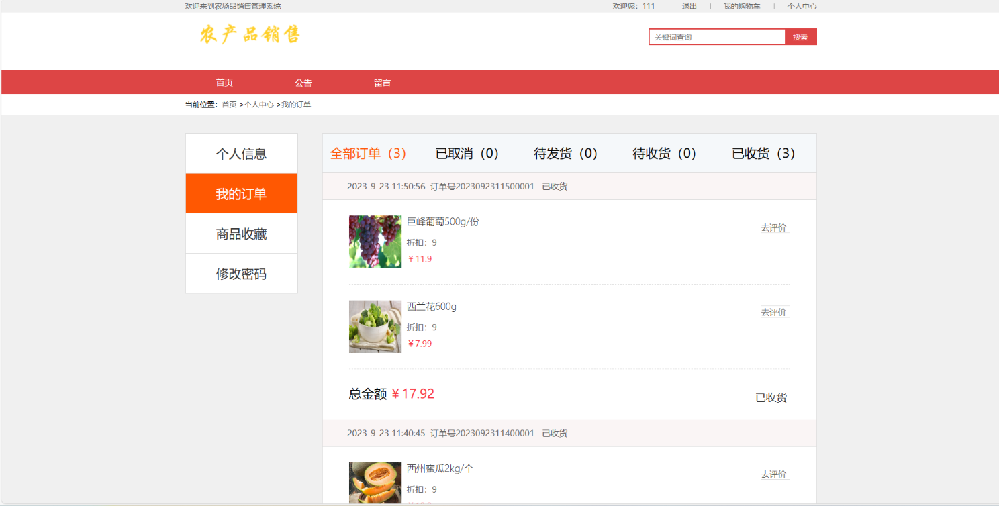
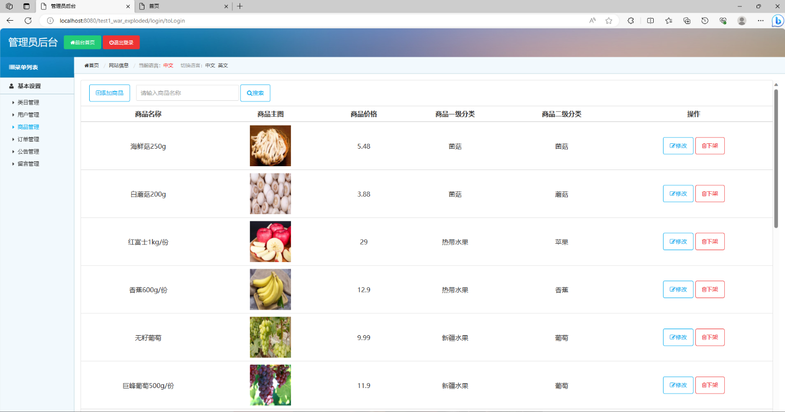

# 基于SSM的农产品销售管理系统

### 完整项目获取

通过网盘分享的文件：农产品销售管理系统

链接: https://pan.baidu.com/s/1rgdPkqEEVghjTjMrVBE69Q?pwd=7u62 提取码: 7u62
--来自百度网盘超级会员v3的分享

通过网盘分享的文件：工具包

链接: https://pan.baidu.com/s/1YmdoJvkjoUjA75wvHLDZ6A?pwd=xm96 提取码: xm96
--来自百度网盘超级会员v3的分享

需要远程项目部署或项目修改和毕业设计也可联系（添加申请时请备注好来意）

远程调试部署联系方式

链接: https://pan.baidu.com/s/1W0dDcoZmayG0c7USJDYBYg?pwd=nqd7 提取码: nqd7
--来自百度网盘超级会员v3的分享

### 项目合集(项目不断更新中)
链接: https://pan.baidu.com/s/1nY-zhvAK0CXYcn3g7LzQnQ?pwd=id3c 提取码: id3c
--来自百度网盘超级会员v3的分享

#### 这些项目一起发你了 可以分享给你需要的同学 调试可找我 也接二次修改和项目定制、毕业设计等

## 接毕业设计和论文

微信联系方式：xzxj0206  QQ：3808981644   (支持修改、 部署调试、 支持代做毕设)

接网站建设、小程序、H5、APP、各种系统等，单片机、嵌入式也可以做

选题+开题报告+任务书+程序定制+安装调试+论文+答辩ppt  都可以做

## 一、介绍

功能（用户端+管理端）:

用户前台功能：登陆，注册，商品分类，搜索，商城首页浏览，查看商品详情页面，收藏与加入购物车（需登录使用），订单，留言功能，个人中心

管理后台功能：类目管理功能（对前台商品分类，增加和删除类目），用户管理，商品管理，订单管理，公告管理，留言管理

语言：java

技术：ssm（spring+spring MVC+mybatis）+jsp+jQuery

数据库：mysql

开发环境：idea或eclipse

## 二、系统部分功能页面展示

